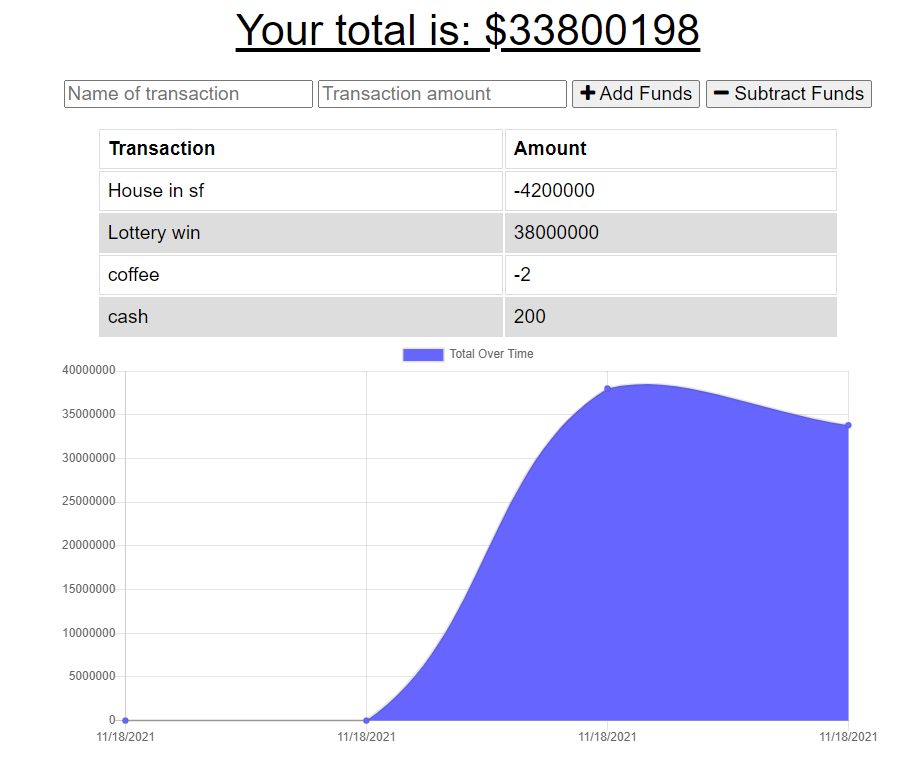
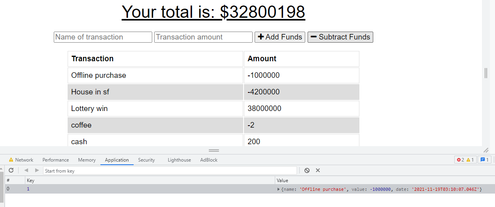

# Budgeter (Progressive Web App)

This is a budgeter app that allows use to enter in transactions which will add or substract from a total sums. The app also displays a graph to show the changes over time, which updates with each transation entered. This is a Progressive Web Application (PWA) with can be downloaded to any computer or smartphone and also works offline. Offline transations are automatically added to the server once the user comes back online.

## Getting Started

Just go ahead and start entering transaction in the app. Make sure to connect to the website at least once before going in offline mode.

## Deployed Link

* [See Site Live!](https://offline-online-budgeter.herokuapp.com/)

## Screenshot

## Built With

* [Javascript](https://developer.mozilla.org/en-US/docs/Web/JavaScript)
* [Node.js](https://nodejs.org/)
* [MongoDB](https://www.mongodb.com/)
* [Mongoose](https://mongoosejs.com/)

## Authors

**Emily Dorgan** 

- [Link to Portfolio Site](https://emdorgan.github.io/updated-portfolio/)
- [Link to Github](https://github.com/emdorgan)
- [Link to LinkedIn](https://www.linkedin.com/in/emily-dorgan/)

## License

This project is licensed under the [MIT License](https://opensource.org/licenses/MIT)